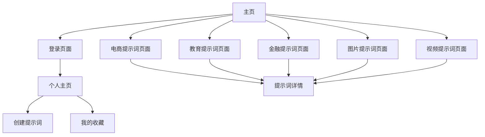

# PromptMarket - AI提示词模板网站产品需求文档

## 1. Product Overview
PromptMarket是一个专业的AI提示词模板分享平台，为用户提供高质量的提示词模板，涵盖电商、教育、金融、图片、视频等多个领域。用户可以浏览、收藏、创建和分享提示词，提升AI使用效率和创作质量。
- 解决用户在使用AI工具时缺乏高质量提示词的问题，为创作者、营销人员、教育工作者等提供专业的提示词资源。
- 目标成为中文AI提示词领域的专业平台，建立活跃的创作者社区生态。

## 2. Core Features

### 2.1 User Roles
| Role | Registration Method | Core Permissions |
|------|---------------------|------------------|
| 游客用户 | 无需注册 | 可浏览所有提示词，但无法收藏和创建 |
| 注册用户 | 邮箱注册/第三方登录 | 可收藏提示词、创建个人提示词、管理个人资料 |

### 2.2 Feature Module
我们的提示词平台包含以下主要页面：
1. **主页**：网站介绍、搜索功能、分类导航、精选提示词展示
2. **电商提示词页面**：产品描述、营销文案、广告创意等电商相关提示词
3. **教育提示词页面**：课程设计、教学辅助、学习指导等教育相关提示词
4. **金融提示词页面**：投资分析、风险评估、财务报告等金融相关提示词
5. **图片提示词页面**：图像生成、视觉设计、艺术创作等图片相关提示词
6. **视频提示词页面**：视频脚本、故事板、动画创意等视频相关提示词
7. **个人主页**：用户资料、创建的提示词、收藏的提示词、个人统计

### 2.3 Page Details
| Page Name | Module Name | Feature description |
|-----------|-------------|---------------------|
| 主页 | Hero区域 | 展示网站标语、搜索框、主要功能介绍 |
| 主页 | 分类导航 | 五个主题分类的卡片式导航，包含图标和描述 |
| 主页 | 精选提示词 | 展示热门和推荐的提示词卡片 |
| 电商提示词页面 | 筛选器 | 按子分类、难度、使用次数等筛选提示词 |
| 电商提示词页面 | 提示词列表 | 使用Tilted Card展示提示词，包含标题、描述、标签、评分 |
| 电商提示词页面 | 搜索功能 | 关键词搜索和高级筛选 |
| 教育提示词页面 | 学科分类 | 按数学、语文、英语等学科分类展示 |
| 教育提示词页面 | 难度等级 | 按初级、中级、高级分类筛选 |
| 金融提示词页面 | 金融工具分类 | 按投资、保险、银行等领域分类 |
| 金融提示词页面 | 专业程度 | 按入门、专业、专家级别分类 |
| 图片提示词页面 | 风格分类 | 按写实、抽象、动漫等风格分类 |
| 图片提示词页面 | 价格筛选 | 按免费、付费筛选提示词 |
| 视频提示词页面 | 类型分类 | 按纪录片、动画、短片等类型分类 |
| 视频提示词页面 | 时长分类 | 按短视频、中长视频分类 |
| 个人主页 | 用户信息 | 显示头像、昵称、注册时间、创作统计 |
| 个人主页 | 我的创作 | 用户创建的提示词列表，支持编辑和删除 |
| 个人主页 | 我的收藏 | 收藏的提示词列表，支持取消收藏 |
| 个人主页 | 创建提示词 | 提示词创建表单，包含标题、描述、分类、标签等字段 |
| 登录注册页面 | 登录表单 | 邮箱密码登录、第三方登录选项 |
| 登录注册页面 | 注册表单 | 邮箱注册、密码设置、用户协议确认 |

## 3. Core Process
**游客用户流程：**
用户访问主页 → 浏览分类或搜索提示词 → 查看提示词详情 → 复制使用提示词

**注册用户流程：**
用户注册/登录 → 浏览提示词 → 收藏感兴趣的提示词 → 访问个人主页管理收藏 → 创建自己的提示词 → 分享给其他用户

**提示词创建流程：**
登录用户 → 进入个人主页 → 点击创建提示词 → 填写表单信息 → 选择分类和标签 → 预览和发布

## 4. User Interface Design
### 4.1 Design Style
- **主色调**：深蓝色 (#1a1a2e) 作为主背景，蓝色 (#4f46e5) 作为强调色
- **辅助色**：灰色 (#6b7280) 用于次要文本，白色 (#ffffff) 用于卡片背景
- **按钮风格**：圆角按钮，渐变背景，悬停效果
- **字体**：中文使用苹方/微软雅黑，英文使用Inter/Roboto，主标题18-24px，正文14-16px
- **布局风格**：卡片式设计，网格布局，响应式设计
- **图标风格**：线性图标，统一的视觉风格，支持主题色彩

### 4.2 Page Design Overview
| Page Name | Module Name | UI Elements |
|-----------|-------------|-------------|
| 主页 | Hero区域 | 大标题渐变文字，居中搜索框，深色背景配紫色渐变 |
| 主页 | 分类卡片 | 4x1网格布局，每个卡片包含图标、标题、描述，悬停3D效果 |
| 提示词页面 | 筛选侧边栏 | 左侧固定侧边栏，分类复选框，价格滑块，深色背景 |
| 提示词页面 | Tilted Card | 3D倾斜卡片效果，包含标题、描述、标签、评分星级、价格 |
| 个人主页 | 用户信息卡 | 圆形头像，用户统计数据，渐变背景卡片 |
| 个人主页 | 标签页导航 | 我的创作/我的收藏切换，下划线动画效果 |

### 4.3 Responsiveness
桌面优先设计，完全响应式适配移动端。移动端采用堆叠布局，侧边栏改为抽屉式，卡片网格调整为单列显示，优化触摸交互体验。