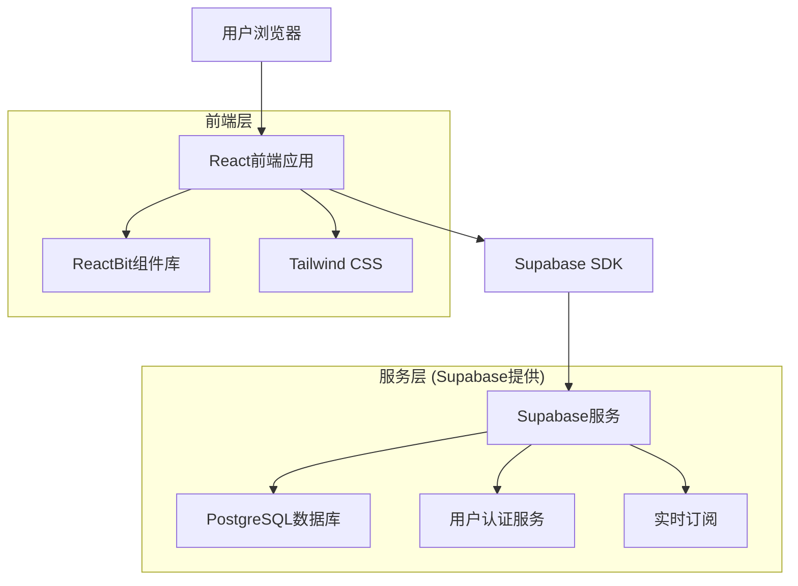
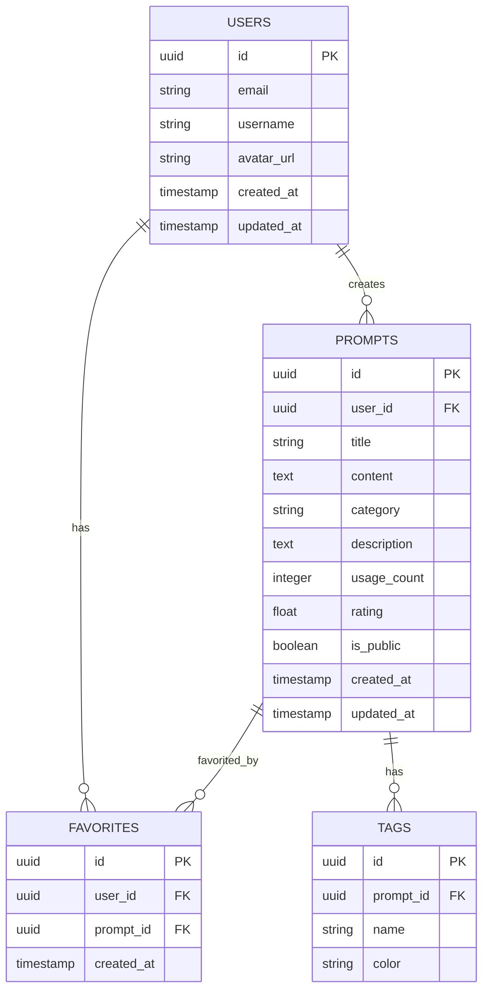

# PromptMarket - 技术架构文档

## 1. Architecture design



## 2. Technology Description
- Frontend: React@18 + ReactBit组件库 + Tailwind CSS@3 + Vite
- Backend: Supabase (PostgreSQL + 认证 + 实时功能)
- 状态管理: React Context + useState/useEffect
- 路由: React Router@6
- 图标: Lucide React
- 动画: Framer Motion

## 3. Route definitions
| Route | Purpose |
|-------|---------|
| / | 主页，展示网站介绍和分类导航 |
| /ecommerce | 电商提示词页面，展示电商相关提示词 |
| /education | 教育提示词页面，展示教育相关提示词 |
| /finance | 金融提示词页面，展示金融相关提示词 |
| /images | 图片提示词页面，展示图像生成相关提示词 |
| /videos | 视频提示词页面，展示视频创作相关提示词 |
| /login | 登录页面，用户认证 |
| /register | 注册页面，用户注册 |
| /profile | 个人主页，用户管理个人信息和提示词 |
| /prompt/:id | 提示词详情页面，显示单个提示词的详细信息 |

## 4. API definitions
### 4.1 Core API

用户认证相关 (Supabase Auth)
```
POST /auth/v1/signup
```
Request:
| Param Name| Param Type  | isRequired  | Description |
|-----------|-------------|-------------|-------------|
| email     | string      | true        | 用户邮箱 |
| password  | string      | true        | 用户密码 |

Response:
| Param Name| Param Type  | Description |
|-----------|-------------|-------------|
| user      | object      | 用户信息对象 |
| session   | object      | 会话信息 |

提示词相关 (Supabase Database)
```
GET /rest/v1/prompts
```
Request:
| Param Name| Param Type  | isRequired  | Description |
|-----------|-------------|-------------|-------------|
| category  | string      | false       | 提示词分类筛选 |
| search    | string      | false       | 搜索关键词 |
| limit     | number      | false       | 返回数量限制 |

Response:
| Param Name| Param Type  | Description |
|-----------|-------------|-------------|
| data      | array       | 提示词列表 |
| count     | number      | 总数量 |

用户收藏相关
```
POST /rest/v1/favorites
```
Request:
| Param Name| Param Type  | isRequired  | Description |
|-----------|-------------|-------------|-------------|
| user_id   | uuid        | true        | 用户ID |
| prompt_id | uuid        | true        | 提示词ID |

## 5. Data model
### 5.1 Data model definition


### 5.2 Data Definition Language
用户表 (users)
```sql
-- 创建用户表 (扩展Supabase auth.users)
CREATE TABLE public.profiles (
    id UUID REFERENCES auth.users(id) PRIMARY KEY,
    username VARCHAR(50) UNIQUE,
    avatar_url TEXT,
    bio TEXT,
    created_at TIMESTAMP WITH TIME ZONE DEFAULT NOW(),
    updated_at TIMESTAMP WITH TIME ZONE DEFAULT NOW()
);

-- 启用行级安全
ALTER TABLE public.profiles ENABLE ROW LEVEL SECURITY;

-- 创建策略
CREATE POLICY "用户可以查看所有资料" ON public.profiles FOR SELECT USING (true);
CREATE POLICY "用户只能更新自己的资料" ON public.profiles FOR UPDATE USING (auth.uid() = id);
```

提示词表 (prompts)
```sql
-- 创建提示词表
CREATE TABLE public.prompts (
    id UUID PRIMARY KEY DEFAULT gen_random_uuid(),
    user_id UUID REFERENCES auth.users(id) ON DELETE CASCADE,
    title VARCHAR(200) NOT NULL,
    content TEXT NOT NULL,
    description TEXT,
    category VARCHAR(50) NOT NULL CHECK (category IN ('ecommerce', 'education', 'finance', 'images', 'videos')),
    usage_count INTEGER DEFAULT 0,
    rating DECIMAL(3,2) DEFAULT 0.00,
    is_public BOOLEAN DEFAULT true,
    created_at TIMESTAMP WITH TIME ZONE DEFAULT NOW(),
    updated_at TIMESTAMP WITH TIME ZONE DEFAULT NOW()
);

-- 创建索引
CREATE INDEX idx_prompts_category ON public.prompts(category);
CREATE INDEX idx_prompts_user_id ON public.prompts(user_id);
CREATE INDEX idx_prompts_created_at ON public.prompts(created_at DESC);

-- 启用行级安全
ALTER TABLE public.prompts ENABLE ROW LEVEL SECURITY;

-- 创建策略
CREATE POLICY "所有人可以查看公开提示词" ON public.prompts FOR SELECT USING (is_public = true);
CREATE POLICY "用户可以查看自己的提示词" ON public.prompts FOR SELECT USING (auth.uid() = user_id);
CREATE POLICY "用户可以创建提示词" ON public.prompts FOR INSERT WITH CHECK (auth.uid() = user_id);
CREATE POLICY "用户可以更新自己的提示词" ON public.prompts FOR UPDATE USING (auth.uid() = user_id);
```

收藏表 (favorites)
```sql
-- 创建收藏表
CREATE TABLE public.favorites (
    id UUID PRIMARY KEY DEFAULT gen_random_uuid(),
    user_id UUID REFERENCES auth.users(id) ON DELETE CASCADE,
    prompt_id UUID REFERENCES public.prompts(id) ON DELETE CASCADE,
    created_at TIMESTAMP WITH TIME ZONE DEFAULT NOW(),
    UNIQUE(user_id, prompt_id)
);

-- 创建索引
CREATE INDEX idx_favorites_user_id ON public.favorites(user_id);
CREATE INDEX idx_favorites_prompt_id ON public.favorites(prompt_id);

-- 启用行级安全
ALTER TABLE public.favorites ENABLE ROW LEVEL SECURITY;

-- 创建策略
CREATE POLICY "用户只能查看自己的收藏" ON public.favorites FOR SELECT USING (auth.uid() = user_id);
CREATE POLICY "用户可以添加收藏" ON public.favorites FOR INSERT WITH CHECK (auth.uid() = user_id);
CREATE POLICY "用户可以删除自己的收藏" ON public.favorites FOR DELETE USING (auth.uid() = user_id);
```

标签表 (tags)
```sql
-- 创建标签表
CREATE TABLE public.tags (
    id UUID PRIMARY KEY DEFAULT gen_random_uuid(),
    prompt_id UUID REFERENCES public.prompts(id) ON DELETE CASCADE,
    name VARCHAR(50) NOT NULL,
    color VARCHAR(7) DEFAULT '#3B82F6'
);

-- 创建索引
CREATE INDEX idx_tags_prompt_id ON public.tags(prompt_id);
CREATE INDEX idx_tags_name ON public.tags(name);

-- 启用行级安全
ALTER TABLE public.tags ENABLE ROW LEVEL SECURITY;

-- 创建策略
CREATE POLICY "所有人可以查看标签" ON public.tags FOR SELECT USING (true);
CREATE POLICY "用户可以为自己的提示词添加标签" ON public.tags FOR INSERT WITH CHECK (
    EXISTS (
        SELECT 1 FROM public.prompts 
        WHERE id = prompt_id AND user_id = auth.uid()
    )
);

-- 初始化示例数据
INSERT INTO public.prompts (user_id, title, content, description, category) VALUES
('00000000-0000-0000-0000-000000000000', '电商产品描述生成器', '请为以下产品生成吸引人的描述：[产品名称]，主要特点：[特点列表]', '帮助电商卖家快速生成产品描述', 'ecommerce'),
('00000000-0000-0000-0000-000000000000', '教学课程设计助手', '请设计一个关于[主题]的教学课程，目标学生：[年级/水平]，课程时长：[时间]', '协助教师设计结构化的教学课程', 'education');
```